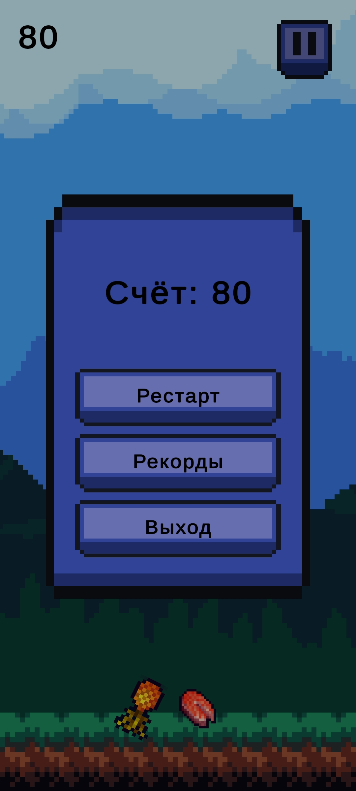
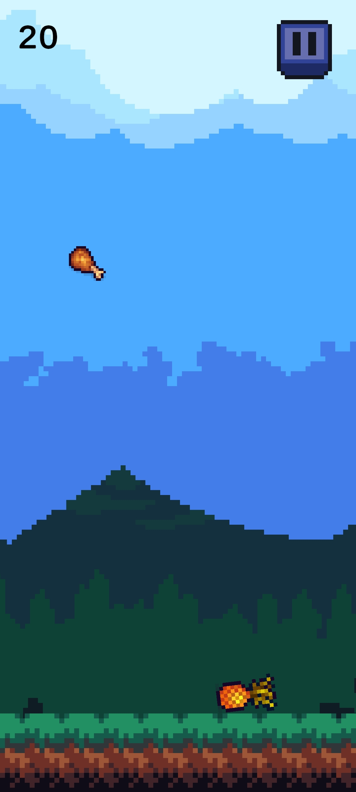
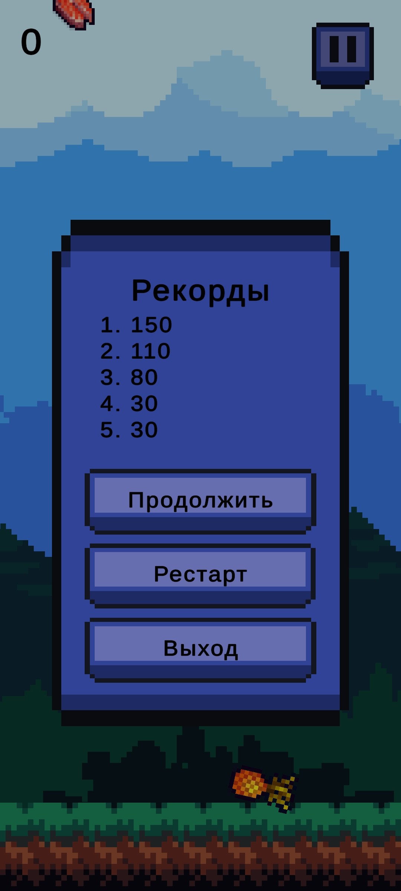

# Об игре
- Аркадная игра про сбор падающей еды. 
- Главная цель - поймать всю еду.
- Управление происходит наклонами устройства (Android)

## Установка/билд
1. Клонируем удобным для вас образом репозиторий
2. Открываем проект в Unity v2022.3.39f1
3. Для билда переходим в File -> Build Settings... или Ctrl + Shift + B

## Плагины/ассеты
- VContainer
- 2D Simple UI Pack
- Free Pixel Food
- Platformer Tileset - Pixelart Grasslands
